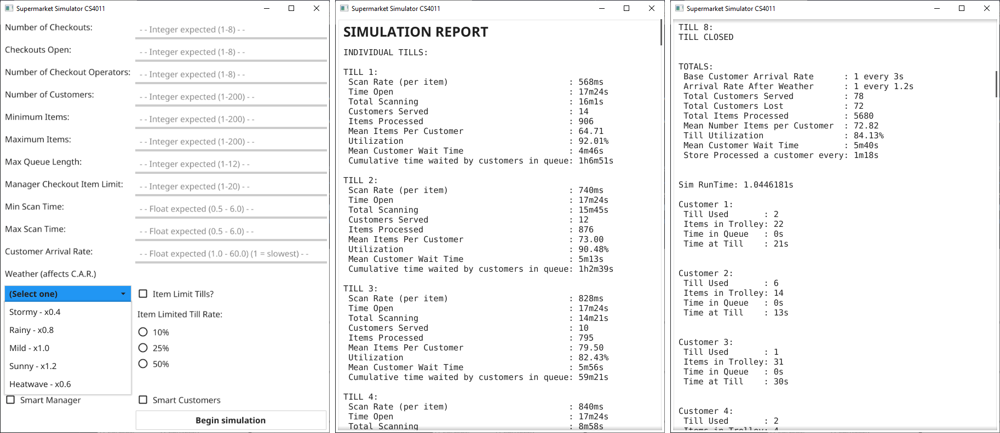

# CS4011: Concurrent Supermarket Simulation
### [Adam Aherne](https://github.com/underwaterjesus "Adam's GitHub") - [Ronan McMullen](https://github.com/RoMcMu "Ronan's GitHub") - [Eoin Purtill](https://github.com/EoinPurtill "Eoin's GitHub") - [Tedis Stumbrs](https://github.com/Tedis32 "Tedis' GitHub")

The goal of this assignment was to create a supermarket simulation in the Go programming language, that can run in a concurrent manner. 
Our submission also has the added value of a graphical user interface. This was created using the <a title="Fyne Homepage" href="https://fyne.io">Fyne</a> widget API. This API is cross platform and should run on most opersting systems. 

 
Our submission allows users to simulate the passage of up to 200 customers through a variable number of checkouts. 
The user can specify:

* the number of checkouts;
* the number of open checkouts;
* the number of checkout operators on duty;
* the behaviour of the supermarket manager;
* the behaviour of customers;
* the maximum number of customers allowed in a queue;
* a number of restrictions that the manager can place on a checkout, eg. an item limit;
* the minimum and maximum number items per customer;
* the customer arrival rate (CAR);
* the type of weather, which effects the CAR.

 

The simulation uses a Goroutine for each checkout in operation. A checkout will only operate if it is open and has an operator. 
Queues are represented by Go Channels. The passage of a customer through the checkouts, possibly leaving without completing their purchases if it is too busy, is executed using a number of Go's concurrency constructs.

 

The simulation is scaled so that a millisecond represents a real-world second. The simulation collects a number of statistics.

 
The statistics collected are:

### For each checkout:
* scan Rate per item;
* length of time checkout was open;
* total time spent scanning;
* number of customers served;
* number of items processed;
* mean number of items per customer;
* checkout utilization;
* mean customer wait time;
* cumulative time waited by customers in queue.

### General:

* base CAR;
* CAR after weather modifier;
* total time spent scanning;
* total customers served;
* total customers lost;
* total items processed;
* mean number of items per customer;
* total checkout utilization;
* mean customer wait time;
* mean time taken to process a customer;
* total time of the simulation.

As per the requirements for the assignment, the details of each customer transaction are provided for the user. 
These details include: 
* the number of the till used;
* the number of items purchased;
* time the customer spent in the que;
* time it took for the customer to be processed once they reached the front of their queue.

As this was a university assignment, long-term support will not be provided and this repository is unlikely to be updated again. We leave our code up here for anybody who may be interested or is undertaking a similar project.

 

Below, screenshots of various parts of the graphical user interface are shown. 
The image on the left shows the parameter entry screen that a user sees on starting the program. The middle image shows the simulation statistics for each individual till. These are displayed after the simulation has completed. The image on the right shows the overall simulation statistics for the supermarket, as well as the transaction details for each customer served. This is shown further down on the same screen as the individual till statistics. Users simply need to scroll down the screen.

